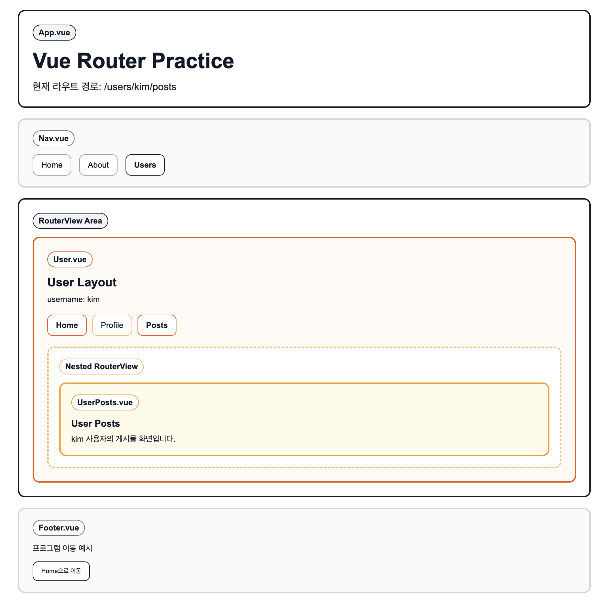

# Vue Router 학습

## 목차

1. [프로젝트 개요](#프로젝트-개요)
2. [학습한 내용](#학습한-내용)
3. [다음에 학습할 내용](#다음에-학습할-내용)

## 프로젝트 개요

- 이 프로젝트는 Vue Router를 직접 구성하면서 라우팅 흐름을 학습하기 위한 실습용 프로젝트다.
- 단순 페이지 이동뿐 아니라 동적 파라미터, 404 처리, 중첩 라우트까지 단계적으로 연습하는 것을 목표로 한다.
- 학습 완료 후에는 Nuxt.js로 전환. 서버 사이드 렌더링(SSR) 프로젝트로 전환한다.

파일 구조

```text
src/
├── App.vue                    # 공통 레이아웃과 <RouterView />를 배치한 최상위 컴포넌트
├── components/
│   ├── About.vue
│   ├── Home.vue
│   ├── Common/               # 내비게이션, 푸터, 404 페이지 같은 공통 UI 영역
│   │   ├── Footer.vue
│   │   ├── Header.vue
│   │   ├── Nav.vue
│   │   └── NotFound.vue
│   └── User/                 # 사용자 관련 중첩 라우트 실습 컴포넌트
│       ├── User.vue
│       ├── UserHome.vue
│       ├── UserPosts.vue
│       └── UserProfile.vue
├── hooks/
├── main.js                   # Vue 앱 생성 후 라우터를 등록하는 시작점
└── router.js                 # 전체 라우트 경로를 정의하는 파일
```

## 학습한 내용

1. [라우터 시작하기](./docs/01-router-basics.md)
2. [동적 라우트 매칭](./docs/02-dynamic-routes.md)
3. [모든 경로와 404 Not Found 처리](./docs/03-not-found-catch-all.md)
4. [중첩 라우트](./docs/04-nested-routes.md)

## 다음에 학습할 내용

1. 이름 기반 라우팅, 중첩네임드 뷰
2. 네비게이션 가드
3. 라우트 컴포넌트에 props 전달
4. RouterView 슬롯

## Overview


