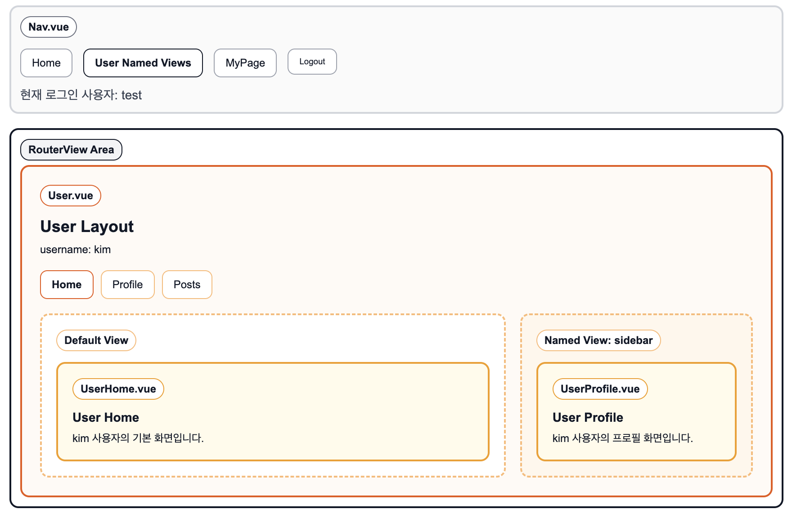

# 중첩 라우트

## 부모 라우트와 자식 라우트의 역할

- `router.js`에서 `path: '/users/:username'`은 부모 라우트이고 `component: User`는 공통 레이아웃 역할을 한다.
- `children`에 들어있는 `UserHome`, `UserProfile`, `UserPosts`는 `User.vue` 안에서 바뀌어 표시되는 자식 페이지다.
- 부모 라우트가 먼저 매칭된 뒤, 자식 라우트가 `User.vue`의 `<RouterView />` 안에 렌더링된다.

```text
/users/kim
User.vue
└─ <RouterView /> -> UserHome.vue

/users/kim/profile
User.vue
└─ <RouterView /> -> UserProfile.vue

/users/kim/posts
User.vue
└─ <RouterView /> -> UserPosts.vue
```

## `component: User`를 주는 이유

- `component: User`는 `/users/:username` 아래에서 공통으로 유지할 화면 틀을 지정하는 코드다.
- 사용자 공통 제목, 탭 메뉴, 레이아웃은 `User.vue`에 두고 내부 내용만 자식 라우트로 바꾸는 식으로 사용한다.
- 그래서 `User.vue`에는 자식 컴포넌트가 들어올 자리인 `<RouterView />`가 꼭 필요하다.

## `path: ''`의 의미

- 자식 라우트의 `path: ''`는 `/users`를 만드는 코드가 아니다.
- 의미는 부모 경로가 이미 매칭된 상태에서 추가 경로가 없으면 이 자식을 기본으로 보여준다는 뜻이다.
- 따라서 `path: ''`는 `/users/:username` 주소에서 기본 자식 화면을 보여주는 역할이다.

즉:

- `/users/kim` -> 부모 매칭 성공, 기본 자식 `UserHome`
- `/users/kim/profile` -> 부모 매칭 성공, 자식 `UserProfile`
- `/users/kim/posts` -> 부모 매칭 성공, 자식 `UserPosts`
- `/users` -> `:username` 값이 없어서 부모 매칭 실패, 전역 404로 이동

## 왜 `/users`는 404가 뜨는가

- 현재 라우트는 `/users/:username`만 정의되어 있고 `/users`는 따로 등록되어 있지 않다.
- 그래서 `/users`로 이동하면 부모 라우트가 매칭되지 않는다.
- 이 경우 마지막의 catch-all 라우트 `/:pathMatch(.*)*`가 받아서 `NotFound` 페이지를 보여준다.

## 상대 경로 링크와 실제 주소

- `User.vue` 안에서 `<RouterLink to="profile">`처럼 쓰면 현재 부모 경로 뒤에 상대적으로 붙는다.
- 따라서 `/users/kim` 화면 안에서 `to="profile"`은 `/users/kim/profile`로 이동한다.
- 같은 방식으로 `to="posts"`는 `/users/kim/posts`로 이동한다.

## 한 문장 정리

- 중첩 라우트는 부모 컴포넌트는 유지하고, 그 안의 `<RouterView />` 자리만 자식 컴포넌트로 바꿔 끼우는 방식이다.

## 중첩 네임드 뷰

### 네임드 뷰란

- 기본 중첩 라우트는 부모 컴포넌트 안의 `<RouterView />` 한 곳에만 자식 컴포넌트를 렌더링한다.
- 네임드 뷰는 `<RouterView name="sidebar" />`처럼 이름이 있는 여러 개의 뷰 영역을 두고, 한 번의 라우트 매칭으로 여러 컴포넌트를 동시에 보여주는 방식이다.
- 즉, 하나의 자식 라우트가 `default` 뷰와 `sidebar` 뷰를 함께 채울 수 있다.

### 기본 중첩 라우트와의 차이

기본 중첩 라우트:

```js
{
  path: 'posts',
  component: UserPosts
}
```

- 부모 안의 기본 `<RouterView />` 한 곳만 바뀐다.

중첩 네임드 뷰:

```js
{
  path: 'posts',
  components: {
    default: UserPosts,
    sidebar: UserHome,
  },
}
```

- 기본 뷰와 이름 있는 뷰를 동시에 렌더링한다.

### 이번 프로젝트에서의 적용 방식

`router.js`의 `/users/:username` 자식 라우트에서 `component` 대신 `components`를 사용했다.

```js
{
  path: '',
  name: 'userHome',
  components: {
    default: UserHome,
    sidebar: UserProfile,
  },
},
{
  path: 'profile',
  name: 'userProfile',
  components: {
    default: UserProfile,
    sidebar: UserPosts,
  },
},
{
  path: 'posts',
  name: 'userPosts',
  components: {
    default: UserPosts,
    sidebar: UserHome,
  },
}
```

이 설정은 `User.vue` 안의 두 개의 `RouterView`와 연결된다.

```vue
<RouterView />
<RouterView name="sidebar" />
```

### 실제 렌더링 결과

- `/users/kim`
  `default` -> `UserHome.vue`
  `sidebar` -> `UserProfile.vue`

- `/users/kim/profile`
  `default` -> `UserProfile.vue`
  `sidebar` -> `UserPosts.vue`

- `/users/kim/posts`
  `default` -> `UserPosts.vue`
  `sidebar` -> `UserHome.vue`

즉, 부모 레이아웃 `User.vue`는 유지되고, 그 안의 두 영역만 라우트에 따라 함께 바뀐다.

### 왜 사용하는가

- 한 화면 안에서 메인 콘텐츠와 보조 콘텐츠를 나눠 보여줄 수 있다.
- 부모 레이아웃을 유지하면서 여러 영역을 동시에 교체할 수 있다.
- 예를 들어 메인 영역, 사이드바, 탭 영역, 보조 패널 같은 구조를 라우터 기준으로 제어할 수 있다.

### 한 문장 정리

- 중첩 네임드 뷰는 부모 컴포넌트 안에 여러 개의 `RouterView`를 두고, 자식 라우트가 각 영역에 들어갈 컴포넌트를 동시에 지정하는 방식이다.


